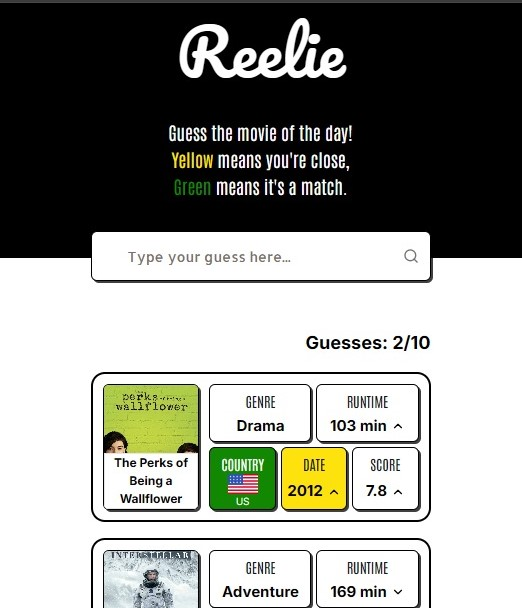
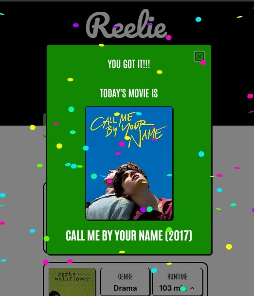

# Reelie 🎬

A daily movie guessing game inspired by Wordle. Guess the movie of the day based on clues — each guess reveals how close you are through color-coded feedback. [Play now!](https://reelie.vercel.app)

## Screenshots

<p align="center">
  
  
</p>
<!-- Add screenshots here -->

## How to Play

- Type a movie title in the search box and select it from the suggestions
- Each guess reveals how your movie compares to the movie of the day
- 🟩 **Green** means it's a match
- 🟨 **Yellow** means you're close
- You have **10 guesses** to find the movie
- A new movie is available every day

## Tech Stack

- **Framework** — Next.js (Pages Router)
- **Language** — TypeScript
- **Styling** — Tailwind CSS
- **Database** — MongoDB via Prisma
- **UI Components** — shadcn/ui
- **Animations** — Framer Motion
- **Movie Data** — TMDB API

## Getting Started

### Prerequisites

- Node.js 18+
- A MongoDB database
- A [TMDB API](https://www.themoviedb.org/documentation/api) Bearer token

### Installation

1. Clone the repository

```bash
git clone https://github.com/your-username/reelie.git
cd reelie
```

2. Install dependencies

```bash
npm install
```

3. Set up environment variables — create a `.env` file at the root:

```env
DATABASE_URL="your-mongodb-connection-string"
NEXT_PUBLIC_TMDB_BEARER="your-tmdb-bearer-token"
CRON_SECRET="your-cron-secret"
```

4. Generate the Prisma client

```bash
npx prisma generate
```

5. Run the development server

```bash
npm run dev
```

Open [http://localhost:3000](http://localhost:3000) to see the app.

### Seeding the Database

To populate the database with movies, call the sync endpoint:

```
GET /api/sync-movies?secret=YOUR_CRON_SECRET
```

This fetches the top 1000 rated movies from TMDB and saves them to the database. It also automatically picks the first daily movie.

To manually pick a new daily movie:

```
GET /api/pick-and-save-daily-movie?secret=YOUR_CRON_SECRET
```

## Project Structure

```
src/
├── components/
│   └── ui/          # UI components (shadcn + custom)
├── hooks/           # Custom React hooks
├── lib/             # Prisma client and utilities
├── pages/
│   ├── api/         # API routes
│   └── index.tsx    # Main game page
├── styles/          # Global styles
└── types/           # Shared TypeScript interfaces
```
